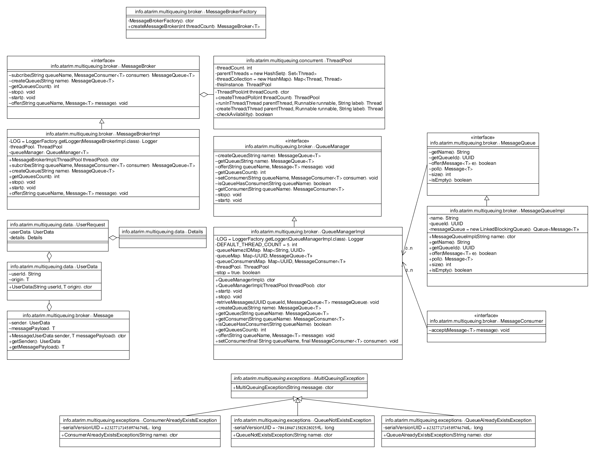

Multi Quing System Assignment 
==================
Implement a multi-queuing software system that supports the following use cases:
* multiple users submit individual requests into the system, each in a different volume and rate (e.g. user Alice submits 1000 requests every minute, while user Bob submits 5 requests every second, etc.).
* Each user’s requests need to be processed in the order by which they were submitted, but there is no order between different users.  For example, it is possible that user Alice’s requests, which have been submitted at 9:00am will be handled – in order – only after user Bob’s  requests, which have been submitted at 9:01am. 
* Since there is a variance in volume and rate between the users, the system should practice fairness in handling the request of the different users, so that handling user Alice’s requests will not starve the other users.

Guidelines
-------------------	
* The main task is designing the data structure and consumer mechanism
* From the user’s point of view, there is something like a queue for each user
* The design should be efficient and elegant as possible, in terms of performance, resource consumption and complexity
* Bonus points for using as little locking as possible
* Total code should not exceed 1500 lines (preferably <300)
* Comments are not counted as lines of code, so you are encouraged to write them

Deliverables
-------------------	
1. README file, describing the solution in general (algorithm and flow), and the main classes / functions / structures 
* Source code in a generic programming language (Java, Python, etc.)
* Include unit test that demonstrates the use case (bonus points for allowing configuration)
* The whole thing should run as a Console application

Class Diagram
-------------------	

Alogorithm
-------------------	
1. Create Message Broker
* Create Thread Pool 
* Queue Manager
* Start the Message Broker (Start Queue watch thread)
* Create Queues (Restriction: Unique Queue Name - no Queues with the same name)
* Subscribe Consumers for the Messages in Queue (Restriction: One consumer per Queue)
* Publish Messages in parallel the separate threads
* Wait until all the messages sent
* Wait until all the messages received
* Stop the Message Broker

To run the application:
-------------------	
From the command line with Gradle:

    $ cd multiqueuing
    $ gradle run

Tests
-------------------	
From the command line with Gradle:

    $ cd multiqueuing
    $ gradle test

* QueueManagerTest
* MessageBrokerFactoryTest

TODO
-------------------	
* Remove Queue
* Unsubscribe Consumer
* Organize classes as Spring Beans

